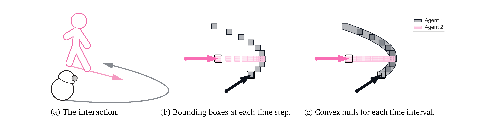
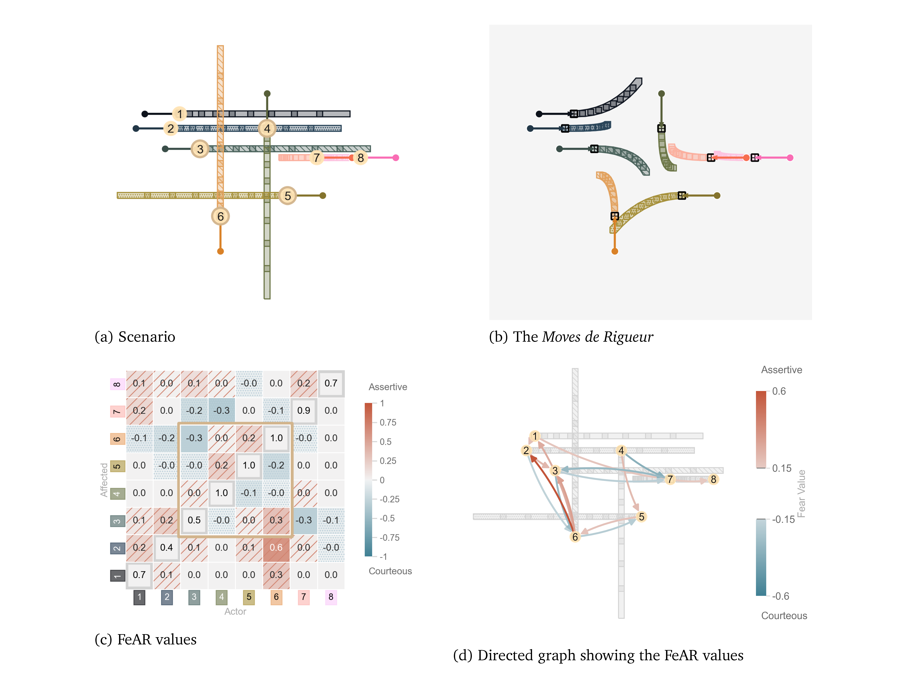

# continuous FeAR

## Quantifying Causal Responsibility in Continuous Spatial Interactions via Feasible Action Space Reduction

Github repository for the publication titled,_"Quantifying Causal Responsibility in Continuous Spatial Interactions via Feasible Action Space Reduction"_
by Ashwin George, Luciano Cavalcante Siebert, David A. Abbink and Arkady Zgonnikov

We propose a Feasible Action-Space Reduction (FeAR) as a metric for causal responsibility in multi-agent spatial interactoins with continuous actions.

---

The code in this repository is based on the code for our earlier publication which can be found at:
https://github.com/DAI-Lab-HERALD/FeAR

---

---

---
## Contents

#### To view the results for the case studies in the paper
- Download the .pkl files for results from: https://osf.io/8mtnf/
and place them in `\FeAR_Results\`.
- Run `cFeAR_Paper_Read_and_Plot_Results.ipynb` to generate plots.

#### To run simulations
- Run `ContinuousFeAR_Sims_Scenario.ipynb`
- Run `ContinuousFeAR_Sims_MdR_Confusion.ipynb` to run simulations with different joint actions as MdRs
- These use scenarios defined in `Scenarios4cFeAR.json`

#### To generate other illustrations in the paper
- Run `Illustrations.ipynb`

## Supplementary Files and Data
 
- https://osf.io/8mtnf/

## Authors

- Ashwin George - PhD student @ TU Delft

## Funding and support

- TU Delft AI Initiative

## Reference

## Copyright notice

Technische Universiteit Delft hereby disclaims all copyright interest in the program “FeAR” (Feasible Action-Space Reduction) written by Ashwin George. Fred van Keulen, Dean of Mechanical Engineering

© 2025, Ashwin George, [HERALD Lab](https://www.tudelft.nl/ai/herald-lab), TU Delft
